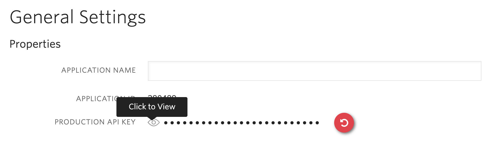

<a href="https://www.twilio.com">
  
</a>

# Twilio Account Security Quickstart - Two-Factor Authentication and Phone Verification


> This template is part of Twilio CodeExchange. If you encounter any issues with this code, please open an issue at [github.com/twilio-labs/code-exchange/issues](https://github.com/twilio-labs/code-exchange/issues).

## About

A simple Python and Django implementation of a website that uses Twilio Account Security services to protect all assets within a folder. Additionally, it shows a Phone Verification implementation.

It uses four channels for delivery: SMS, Voice, Soft Tokens, and Push Notifications. You should have the [Authy App](https://authy.com/download/) installed to try Soft Token and Push Notification support.

Learn more about Account Security and when to use the Authy API vs the Verify API in the [Account Security documentation](https://www.twilio.com/docs/verify/authy-vs-verify).

Implementations in other languages:

| .NET | Java | Node | PHP | Ruby |
| :--- | :--- | :----- | :-- | :--- |
| TBD | [Done](https://github.com/TwilioDevEd/account-security-quickstart-spring)  | [Done](https://github.com/TwilioDevEd/account-security-quickstart-node)  | [Done](https://github.com/TwilioDevEd/account-security-quickstart-php) | [Done](https://github.com/TwilioDevEd/account-security-quickstart-rails)  |

## Features

#### Two-Factor Authentication Demo
- URL path "/protected" is protected with both user session and Twilio Two-Factor Authentication
- One Time Passwords (SMS and Voice)
- SoftTokens
- Push Notifications (via polling)

#### Phone Verification
- Phone Verification
- SMS or Voice Call

## Set up

### Requirements
- This project only runs on Python 3.6+. In some environments when both version 2
and 3 are installed, you may substitute the Python executables below with
`python3` and `pip3` unless you use a version manager such as
[pyenv](https://github.com/pyenv/pyenv).

### Twilio Account Settings

This application should give you a ready-made starting point for writing your own application.
Before we begin, we need to collect all the config values we need to run the application:

| Config Value | Description |
| :----------  | :---------- |
| ACCOUNT_SECURITY_API_KEY  | Create a new Authy application in the [console](https://www.twilio.com/console/authy/). After you give it a name you can view the generated Account Security production API key. This is the string you will later need to set up in your environmental variables.|



### Local Development

1. Clone this repo and `cd` into it.

   ```bash
   git clone https://github.com/TwilioDevEd/account-security-quickstart-django.git
   cd account-security-quickstart-django
   ```

2. Create the virtual environment, load it and install dependencies.

   ```bash
   make install
   ```

3. Set your environment variables. Copy the `env.example` file and edit it.

   ```bash
   cp .env.example .env
   ```

   See [Twilio Account Settings](#twilio-account-settings) to locate the necessary environment variables.

4. Run migrations.

   ```bash
   make serve-setup
   ```

5. Start the development server. Before running the following command, make sure the virtual environment is activated.

   ```bash
   make serve
   ```

6. The application should now be running on http://localhost:8000/, here you can
register a new user account and proceed with a phone verification.

That's it!

### Docker

If you have [Docker](https://www.docker.com/) already installed on your machine, you can use our `docker-compose.yml` to setup your project.

1. Make sure you have the project cloned.
2. Setup the `.env` file as outlined in the [Local Development](#local-development) steps.
3. Run `docker-compose up`.

### Tests

You can run the tests locally by typing the following command, make sure the virtual environment is activated.

```bash
python3 manage.py test
```


### Cloud deployment

Additionally to trying out this application locally, you can deploy it to a variety of host services. Here is a small selection of them.

Please be aware that some of these might charge you for the usage or might make the source code for this application visible to the public. When in doubt research the respective hosting service first.

| Service                           |                                                                                                                                                                                                                           |
| :-------------------------------- | :------------------------------------------------------------------------------------------------------------------------------------------------------------------------------------------------------------------------ |
| [Heroku](https://www.heroku.com/) | [](https://heroku.com/deploy)                                                                                                                                       |

## Resources

- The CodeExchange repository can be found [here](https://github.com/twilio-labs/code-exchange/).

## Contributing

This template is open source and welcomes contributions. All contributions are subject to our [Code of Conduct](https://github.com/twilio-labs/.github/blob/master/CODE_OF_CONDUCT.md).

## License

[MIT](http://www.opensource.org/licenses/mit-license.html)

## Disclaimer

No warranty expressed or implied. Software is as is.

[twilio]: https://www.twilio.com
